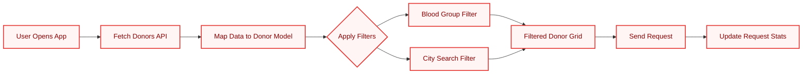
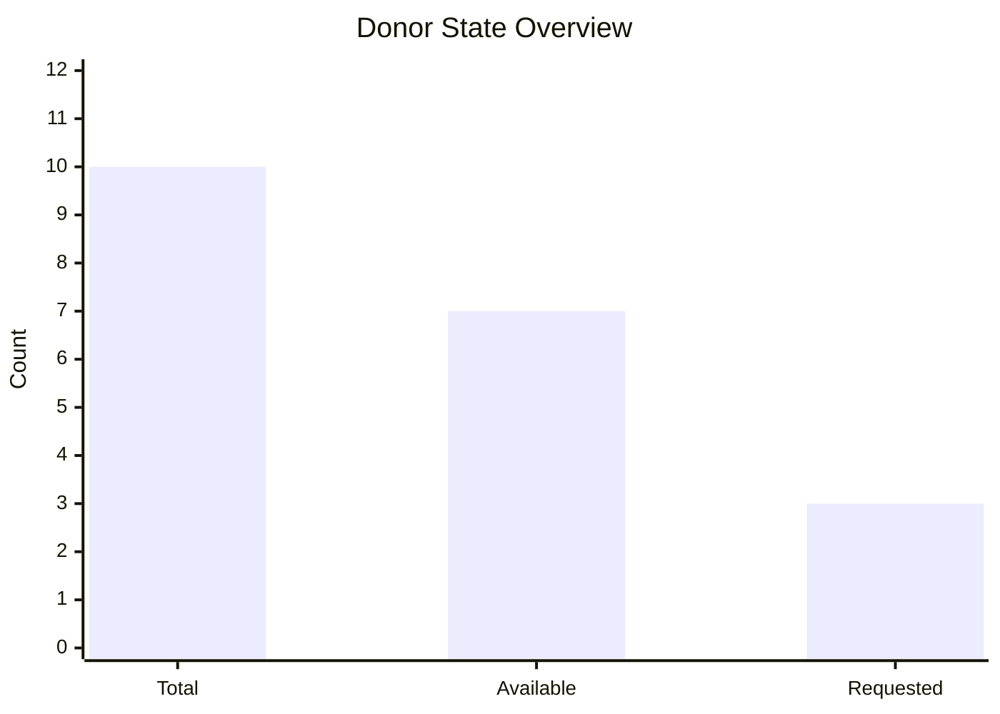
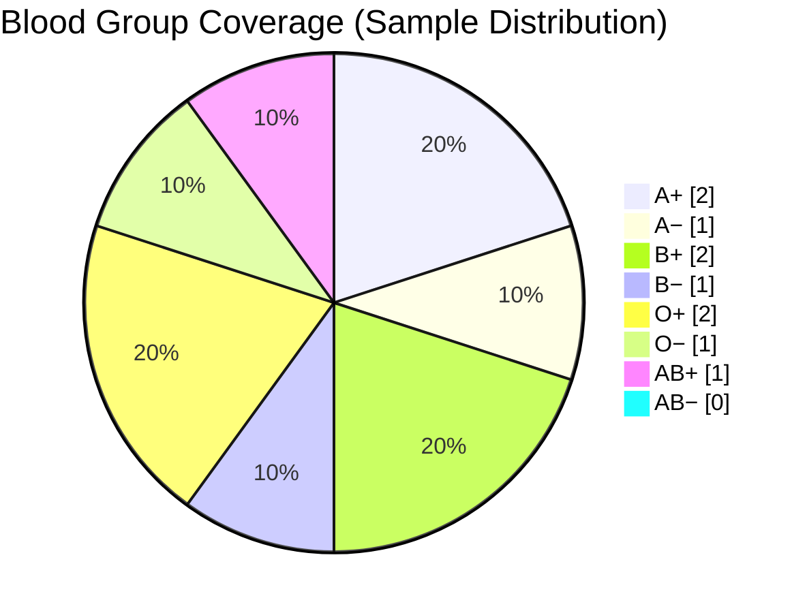

<div align="center">

# BloodConnect - Community Blood Donor Finder


A responsive blood donor discovery app that fetches donor profiles, maps blood groups, and helps users send donation requests quickly.

</div>

## Live Features

- Smart donor list fetched from API (`jsonplaceholder`) and transformed for donation use
- Blood group filtering (`All`, `A+`, `A−`, `B+`, `B−`, `O+`, `O−`, `AB+`, `AB−`)
- City-based search with instant filtering
- Real-time stats panel:
  - Total matched donors
  - Available donors
  - Requests sent
- Request button state tracking (`Request Help` -> `Request Sent`)
- Loading, error, and empty-state UX handling

## 3D-Style App Flow Graph



## 3D Donor Analytics Snapshot





## Tech Stack

- React 19
- Vite 7
- Vanilla CSS (component-scoped styles)
- Fetch API (REST data source)

## Project Structure

```text
Blood_Donor_Project/
|- public/
|- src/
|  |- components/
|  |  |- NavBar.jsx
|  |  |- StatsBar.jsx
|  |  |- BloodGroupFilter.jsx
|  |  |- SearchBar.jsx
|  |  |- DonorList.jsx
|  |  |- DonorCard.jsx
|  |  |- LoadingSpinner.jsx
|  |  |- NoDonorsFound.jsx
|  |- App.jsx
|  |- main.jsx
|  |- index.css
|- package.json
|- vite.config.js
```

## Getting Started

### 1. Clone repository

```bash
git clone <your-repo-url>
cd Blood_Donor_Project
```

### 2. Install dependencies

```bash
npm install
```

### 3. Run development server

```bash
npm run dev
```

### 4. Build for production

```bash
npm run build
```

### 5. Preview production build

```bash
npm run preview
```

## Scripts

- `npm run dev` - start local Vite dev server
- `npm run build` - create optimized production build
- `npm run preview` - preview built app locally
- `npm run lint` - run ESLint checks

## Data Model

Each donor card is derived from remote user records and normalized to:

```js
{
  id,
  name,
  username,
  email,
  phone,
  city,
  bloodGroup,
  available
}
```

## UX States

- `Loading`: Spinner while fetching donor data
- `Error`: Friendly connection/load failure message
- `No Results`: Dedicated empty-state component when filters return zero donors

## Future Enhancements

- Backend integration with real donor database and authentication
- Geolocation-based nearest donor sorting
- Hospital/NGO integration and emergency broadcast mode
- Admin dashboard with richer charts and exportable reports

## Contributing

1. Fork the project
2. Create your feature branch (`git checkout -b feature/amazing-feature`)
3. Commit your changes (`git commit -m "Add amazing feature"`)
4. Push to the branch (`git push origin feature/amazing-feature`)
5. Open a Pull Request

## License

This project is open-source and available under the MIT License.
